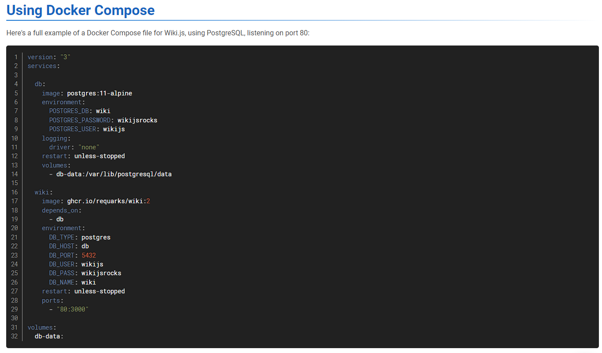
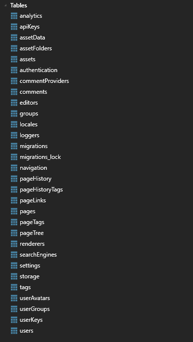
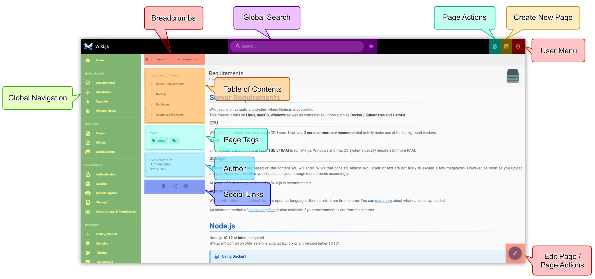
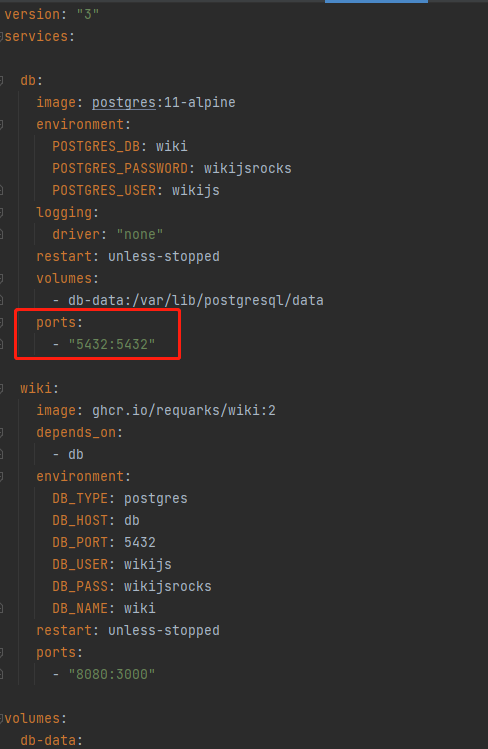

# 概述

Suanpan-wiki 用于搭建算盘学院网站，工程采用 monorepo 文件结构，分为 suanpan-wiki-client 以及 suanpan-wiki-server 两个子工程，分别用于开发学院展示页面和后台接口。

## 教程发布

教程的发布系统，采用了开源框架 [Wiki.js](https://js.wiki/)

该框架提供一整套的文档管理后台，同时支持多种格式的文档发布，包括 Markdown、富文本、Tabular（类Excel文档）导入，还支持编写HTML代码生成页面。

Wiki.js 系统的安装部署相对简单，支持 Docker Compose 部署，并且官方上提供了完整的 docker-compose.yaml 文件。

如下图所示



拷贝配置文件保存为 wiki.yaml，通过执行如下命令即可完成安装

```bash
docker-compose -f wiki.yaml up
```

此处安装了两个docker服务，一个是 Wiki.js 系统，另一个是 postgres 数据库。

Wiki.js 初始化好一整套数据库，在后续开发算盘学院网站时，直接从数据库中获取文章列表。

数据库结构如下图



安装完成后，可通过 http://localhost:8080/ 访问

部署人员通过一些列配置后，即可进入到后台，配置过程略过，常规用户用不到。



Wiki.js 的使用教程详见 [官网](https://docs.requarks.io/guide/intro)

## 教程展示

Wiki.js 提供了文章的发布系统，同时也提供了展示页面。不过其展示页面类似于Wiki的形式，不够丰富美观。

因此考虑设计搭建一套符合雪浪云产品风格，同时能够展示丰富类型内容网站。

参考 [Webflow University](docs/WebflowUniversity.md)

### 文件结构

Suanpan-wiki 工程结构如下

```text
suanpan-wiki
    |- docs // 文档目录
    |- libs // 存放各类第三方依赖库，系统安装配置文件等
    |- scripts // 打包、部署相关脚本
    |- packages // 子工程
    |- .gitignore
    |- lerna.json
    |- package.json
    |- README.md
```

Suanpan-wiki 采用了 monorepo 的工程模式，使用 lerna 进行工程结构管理。

[lerna.json](lerna.json) 配置如下，指定了子工程的路径为 "packages/*"

```json
{
  "packages": [
    "packages/*"
  ],
  "version": "independent"
}
```

### suanpan-wiki-client

suanpan-wiki-client 用于开发算盘学院的教程展示网站，采用了 Vue 3 + Typescript + Ant Design Vue 作为开发框架。

打包产物直接输出到 suanpan-wiki-server/public 下，作为服务端加载的静态页面。

### suanpan-wiki-server

suanpan-wiki-server 用于开发算盘学院的后台接口，采用了 Express 开发框架。

server 从 postgres 中获取 Wiki.js 生成的文章、用户、静态资源等内容，返回给suanpan-wiki-client渲染。

Wiki.js 官方提供的 Docker Compose 配置文件并未开放 postgres 的端口，因此 [wiki.yaml](libs/wiki.yaml) 中将服务端口暴露出来，以便 suanpan-wiki-server 可以读取数据库



# 运行

## 依赖安装

使用lerna相关命令安装依赖，各子工程公共的依赖会安装在根路径下的 node_modules 中。

```bash
lerna bootstrap
```

## 开发

执行

```bash
lerna run dev
```

后，即可通过 http://localhost:30001/ 访问前端页面

## 打包

```bash
lerna run build
```

## 部署

### 打包容器镜像

```shell
npm run docker
```